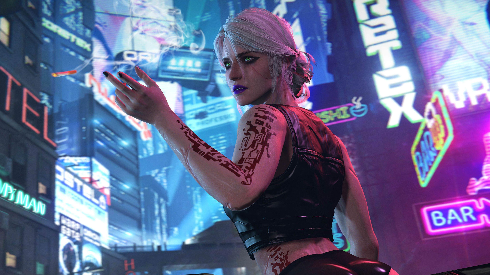
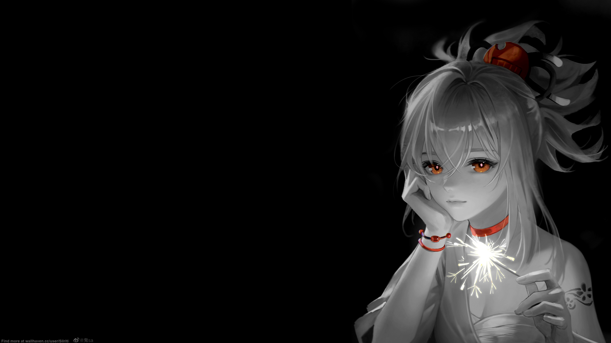
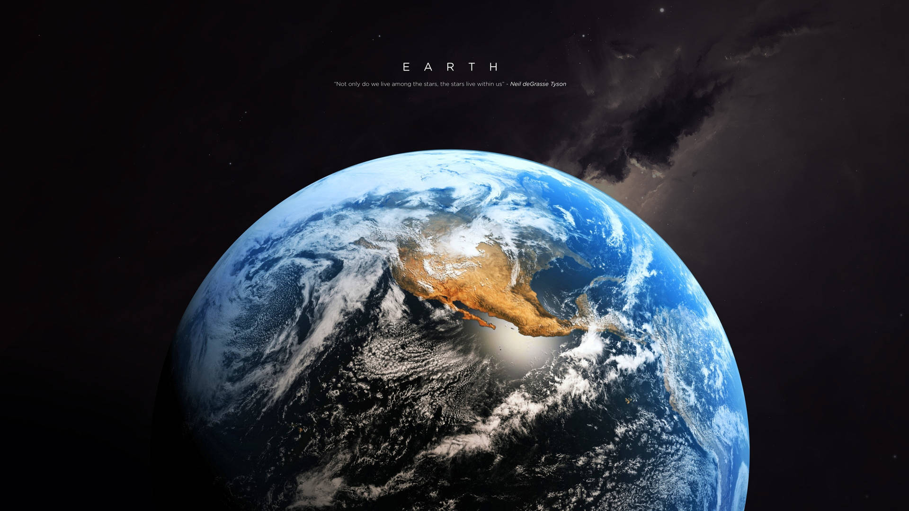

<div align="center">

# 🌌 WALLPAPER VAULT 🌌

```
███╗   ██╗███████╗ ██████╗ ███╗   ██╗    ██╗   ██╗██╗███████╗██╗   ██╗ █████╗ ██╗     ███████╗
████╗  ██║██╔════╝██╔═══██╗████╗  ██║    ██║   ██║██║██╔════╝██║   ██║██╔══██╗██║     ██╔════╝
██╔██╗ ██║█████╗  ██║   ██║██╔██╗ ██║    ██║   ██║██║███████╗██║   ██║███████║██║     ███████╗
██║╚██╗██║██╔══╝  ██║   ██║██║╚██╗██║    ╚██╗ ██╔╝██║╚════██║██║   ██║██╔══██║██║     ╚════██║
██║ ╚████║███████╗╚██████╔╝██║ ╚████║     ╚████╔╝ ██║███████║╚██████╔╝██║  ██║███████╗███████║
╚═╝  ╚═══╝╚══════╝ ╚═════╝ ╚═╝  ╚═══╝      ╚═══╝  ╚═╝╚══════╝ ╚═════╝ ╚═╝  ╚═╝╚══════╝╚══════╝
```

### ⚡ *A personal collection of wallpapers that spark joy* ⚡


</div>

## 💎 About

This is my personal stash of wallpapers — images I use daily or just find aesthetically pleasing. From cyberpunk streets to serene landscapes, anime vibes to abstract dimensions. Consider this a digital gallery of visual inspiration.

**Note:** All images belong to their respective creators. This is purely a personal collection for desktop customization.

---

## 📁 Repository Structure

```
wallpapers/
│
├── 🎤 miku/                   # Vocaloid queen vibes
├── 🌃 futurist/              # Neon-soaked futures
├── 🎧 lofi/                   # Chill aesthetic beats
├── 🌸 anime/                  # 2D aesthetics
├── 🎮 games/                  # Gaming universes
├── 🎨 minimalist/            # Clean & simple
└── 🚀 space/                  # Cosmic wonders
```

---

<div align="center">

## 🖼️ Preview Gallery

*Some highlights from the collection*

| Category | Preview |
|----------|---------|
| **Futurist** |  |
| **Miku** |  |
| **Lofi** |  |
| **Games** |  |
| **Space** |  |

</div>

---

## 🔧 How to Use

### Clone the entire vault:
```bash
git clone https://github.com/oogaara/wallpapers.git
cd wallpapers
```

### Browse online:
Just navigate through the folders above and download whatever catches your eye. Each image is full resolution and ready to use.

### Quick tip:
Set up a script to rotate wallpapers from this repo and keep your desktop fresh automatically.

---

<div align="center">


### ✨ *Keep your desktop fresh and futuristic* ✨

```
[████████████████████] 100% Aesthetic Overload
```

**「 Curated with 💙 and a love for pixels 」**


</div>
